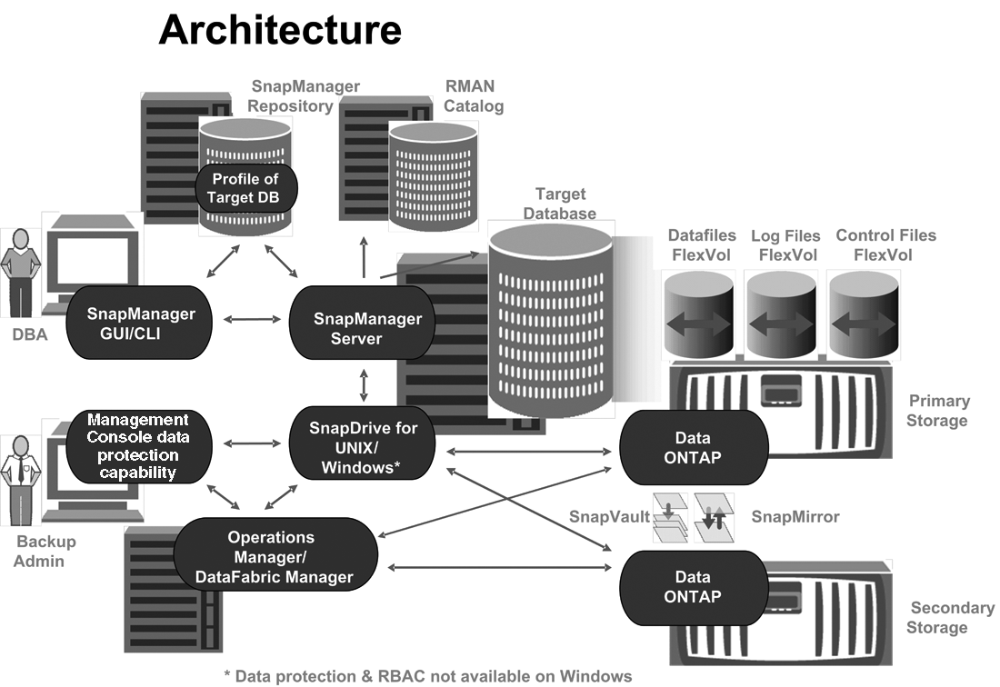

= What the SnapManager for Oracle architecture is
:icons: font
:imagesdir: ../media/

[.lead]
The SnapManager for Oracle architecture includes many components, such as the SnapManager for Oracle host, client, and repository. Other components include the primary and secondary storage systems and other NetApp products.

The SnapManager for Oracle architecture includes the following architectural components:

* SnapManager host
* SnapManager graphical user interface or command-line interface
* SnapManager repository
* Primary storage system
* Secondary storage systems
* SnapDrive for Windows

The following image shows the architecture of SnapManager for Oracle and related components:

